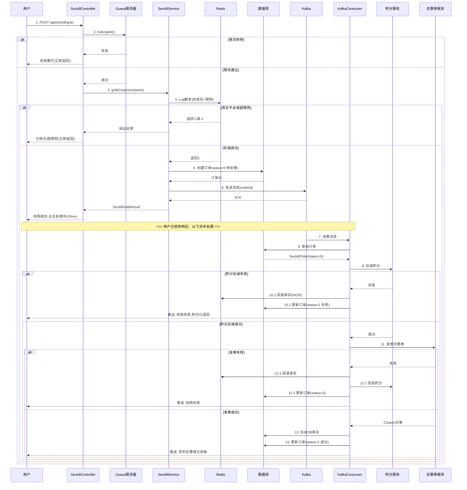
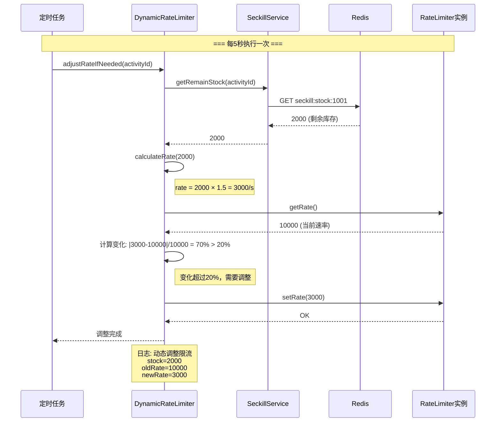
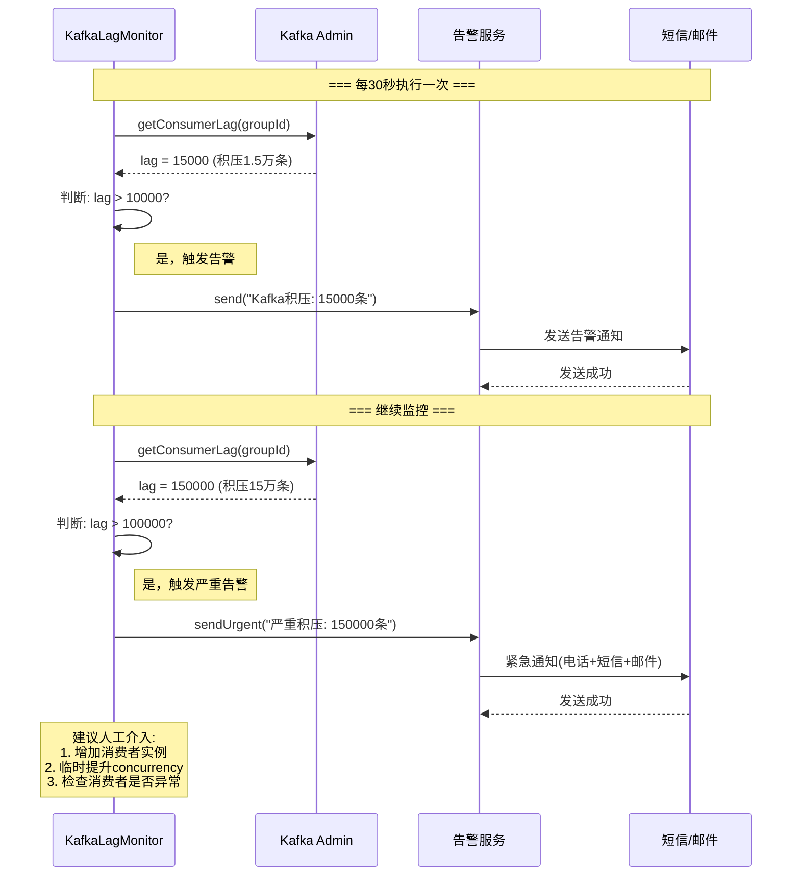

# 订单处理最终一致性解决方案

> **文档创建时间**: 2026-03-26
> 
> **当前系统状态**: ✅ 核心功能已完成，本文档针对三个关键问题进行深度分析与优化

---

## 一、Kafka处理与最终一致性

### 1.1 问题分析

**原始问题**：
1. Kafka 使用异步处理，削峰填谷，如何保证订单处理的最终一致性？
2. 当 Kafka 消息积压时，系统如何应对？
3. 异步处理提前给user返回成功吗？还是等 Kafka 处理完成后再返回结果？
4. 如果提前返回成功，后续处理失败时需要补偿机制。

### 1.2 当前系统实现分析

#### 时序图：当前秒杀抢购流程

```
┌─────────────────────────────────────────────────────────────────────────────────┐
│  当前实现：异步处理 + 补偿机制                                                    │
└─────────────────────────────────────────────────────────────────────────────────┘

┌────────┐   ┌────────────┐   ┌───────┐   ┌───────┐   ┌────────┐
│  用户   │   │ Controller │   │ Redis │   │ Kafka │   │Consumer│
└───┬────┘   └─────┬──────┘   └───┬───┘   └───┬───┘   └───┬────┘
    │              │              │           │           │
    │ 1.POST /grab │              │           │           │
    │─────────────>│              │           │           │
    │              │              │           │           │
    │              │ 2.限流检查    │           │           │
    │              │  (Guava)     │           │           │
    │              │              │           │           │
    │              │ 3.Lua脚本    │           │           │
    │              │  扣库存+限购  │           │           │
    │              │─────────────>│           │           │
    │              │  返回: 1(成功)│           │           │
    │              │<─────────────│           │           │
    │              │              │           │           │
    │              │ 4.创建订单    │           │           │
    │              │  (status=0)  │           │           │
    │              │  待处理状态   │           │           │
    │              │              │           │           │
    │              │ 5.发送Kafka  │           │           │
    │              │─────────────────────────>│           │
    │              │   (orderId)  │           │           │
    │              │              │           │           │
    │ 6.立即返回    │              │           │           │
    │  "抢购成功   │              │           │           │
    │   正在处理中"│              │           │           │
    │<─────────────│              │           │           │
    │   (20ms)    │              │           │           │
    │              │              │           │           │
    │    ★ 用户体验良好，无需等待后续处理 ★      │           │
    │              │              │           │           │
    │              │              │           │  7.消费消息│
    │              │              │           │──────────>│
    │              │              │           │           │
    │              │              │           │   8.扣积分 │
    │              │              │           │   (可能失败)
    │              │              │           │           │
    │              │              │           │   9.发优惠券
    │              │              │           │   (可能失败)
    │              │              │           │           │
    │              │              │           │   10.扣DB库存
    │              │              │           │           │
    │              │              │           │  11.更新订单
    │              │              │           │   status=1
    │              │              │           │  (成功)
    │              │              │           │           │
    │ 12.推送通知   │              │           │           │
    │  "您的优惠券 │              │           │           │
    │   已到账"    │              │           │           │
    │<─────────────────────────────────────────────────────│
    │              │              │           │           │

═══════════════════════════════════════════════════════════════════
异常情况：后续处理失败时的补偿机制
═══════════════════════════════════════════════════════════════════

┌────────┐   ┌────────────┐   ┌───────┐   ┌───────┐   ┌────────┐
│  用户   │   │ Controller │   │ Redis │   │ Kafka │   │Consumer│
└───┬────┘   └─────┬──────┘   └───┬───┘   └───┬───┘   └───┬────┘
    │              │              │           │           │
    │              │              │           │  消费消息  │
    │              │              │           │──────────>│
    │              │              │           │           │
    │              │              │           │  扣积分    │
    │              │              │           │  ✅ 成功   │
    │              │              │           │           │
    │              │              │           │  发优惠券   │
    │              │              │           │  ❌ 失败   │
    │              │              │           │  (系统异常)│
    │              │              │           │           │
    │              │              │           │  ★ 触发补偿 ★
    │              │              │           │           │
    │              │              │  1.回滚    │           │
    │              │              │    Redis库存│           │
    │              │              │<─────────────────────│
    │              │              │   INCR stock│           │
    │              │              │           │           │
    │              │              │  2.回滚积分│           │
    │              │  rollback    │           │           │
    │              │<─────────────────────────────────────│
    │              │  points      │           │           │
    │              │              │           │           │
    │              │  3.更新订单   │           │           │
    │              │    status=2(失败)         │           │
    │              │    failReason │           │           │
    │              │              │           │           │
    │ 4.推送通知    │              │           │           │
    │  "抢购失败   │              │           │           │
    │   积分已退回"│              │           │           │
    │<─────────────────────────────────────────────────────│
    │              │              │           │           │

关键设计：
1. ✅ 提前返回"抢购成功,正在处理中" (不等Kafka)
2. ✅ 订单初始状态=0(待处理)，处理完成后更新为1(成功)或2(失败)
3. ✅ 完整的补偿机制：回滚Redis库存、回滚积分、更新订单状态
4. ✅ 用户体验：立即响应(20ms) + 异步通知最终结果
```

#### 当前代码实现位置

**代码1：SeckillServiceImpl.grabCoupon() - 立即返回**
```java
// 文件：SeckillServiceImpl.java 第96-114行

// 5. 创建秒杀订单(待处理状态)
SeckillOrder order = new SeckillOrder();
order.setOrderNo(orderNo);
order.setStatus(0); // ★ 待处理状态，不是最终状态
order.setGrabTime(LocalDateTime.now());
orderMapper.insert(order);

// 6. 发送Kafka消息异步处理
kafkaTemplate.send(KafkaConfig.TOPIC_SECKILL_ORDER, userId, order.getId().toString());

// 7. 立即返回"抢购成功,正在处理中"，不等Kafka处理完成
return SeckillGrabResult.builder()
        .success(true)
        .orderNo(orderNo)
        .message("抢购成功,正在处理中")  // ★ 明确告知用户"正在处理"
        .build();
```

**代码2：SeckillOrderKafkaConsumer - 补偿机制**
```java
// 文件：SeckillOrderKafkaConsumer.java 第129-177行

catch (Exception e) {
    log.error("秒杀订单处理失败: orderId={}", orderId, e);
    
    if (order != null) {
        // ★ 补偿1: 回滚Redis库存
        rollbackRedisStock(order.getActivityId());
        
        // ★ 补偿2: 回滚积分
        rollbackPointsIfNeeded(order);
        
        // ★ 补偿3: 标记订单失败
        handleOrderFail(order, e.getMessage());
    }
    
    // 确认消息，不重试(已做补偿)
    ack.acknowledge();
}
```

### 1.3 最终一致性保证

#### 什么是最终一致性？

```
┌─────────────────────────────────────────────────────────────────┐
│  强一致性 vs 最终一致性                                          │
└─────────────────────────────────────────────────────────────────┘

强一致性 (同步处理):
┌─────────────────────────────────────────────────────────────────┐
│  用户请求 → 扣库存 → 扣积分 → 发券 → 全部完成后返回             │
│                                                                 │
│  优点: 用户看到"成功"时，券已到账                                │
│  缺点: 响应慢(365ms)，高并发崩溃                                 │
└─────────────────────────────────────────────────────────────────┘

最终一致性 (异步处理):
┌─────────────────────────────────────────────────────────────────┐
│  用户请求 → 扣库存 → 立即返回"处理中" → 后台慢慢处理 → 通知结果  │
│                                                                 │
│  优点: 响应快(20ms)，高并发不崩溃                                │
│  缺点: 需要处理失败补偿                                          │
└─────────────────────────────────────────────────────────────────┘
```

#### 当前系统的最终一致性方案

| 阶段 | 操作 | 状态 | 一致性保证 |
|------|------|------|-----------|
| 1. 抢购 | Redis扣库存 | 立即 | Lua脚本原子性 |
| 2. 下单 | 创建订单(status=0) | 立即 | 数据库事务 |
| 3. 响应 | 返回"处理中" | 立即 | - |
| 4. 扣积分 | 调用积分服务 | 异步 | 失败回滚 |
| 5. 发券 | 创建优惠券 | 异步 | 失败回滚 |
| 6. 同步库存 | 扣DB库存 | 异步 | 忽略失败(Redis为准) |
| 7. 完成 | 更新订单status=1 | 异步 | 数据库事务 |
| 8. 通知 | 推送给用户 | 异步 | - |

**核心策略**：
1. **Redis库存为准**：Redis扣成功 = 抢购成功，DB库存只做记录
2. **订单状态流转**：0(待处理) → 1(成功) / 2(失败)
3. **失败自动补偿**：任何环节失败，自动回滚Redis库存和积分
4. **异步通知用户**：最终结果通过推送告知用户

### 1.4 Kafka消息积压应对

#### 时序图：消息积压场景

```
┌─────────────────────────────────────────────────────────────────────────────────┐
│  场景：秒杀高峰，每秒1万订单，Kafka消费速度跟不上                                  │
└─────────────────────────────────────────────────────────────────────────────────┘

时间轴          生产者              Kafka队列              消费者
────────────────────────────────────────────────────────────────────
12:00:00    │ 1万订单/秒 ──────> │ 积压0条        │ ──> 1000条/秒处理
12:00:01    │ 1万订单/秒 ──────> │ 积压9000条     │ ──> 1000条/秒处理
12:00:02    │ 1万订单/秒 ──────> │ 积压18000条    │ ──> 1000条/秒处理
12:00:05    │ 1万订单/秒 ──────> │ 积压45000条    │ ──> 1000条/秒处理
12:00:10    │ 1万订单/秒 ──────> │ 积压90000条    │ ──> 1000条/秒处理
            │                    │                │
            │  活动结束           │                │
12:01:00    │ 停止生产 ────────> │ 积压540000条   │ ──> 1000条/秒处理
            │                    │                │
            │                    │  继续消费...    │
12:10:00    │                    │ 积压0条         │ ──> 全部处理完成

结果分析:
┌─────────────────────────────────────────────────────────────────┐
│  1. 积压高峰: 54万条消息                                         │
│  2. 消费延迟: 最后一个用户等了9分钟才收到券                      │
│  3. 用户体验: 抢购时立即返回"成功,处理中"，9分钟后收到券通知      │
│  4. 系统稳定性: ✅ 不会崩溃，只是延迟                            │
└─────────────────────────────────────────────────────────────────┘
```

#### 当前系统应对措施

**1. 已实现的优化 (代码位置：SeckillOrderKafkaConsumer.java)**

```java
// ✅ 措施1: 多线程并发消费 (第46行)
@KafkaListener(
    topics = KafkaConfig.TOPIC_SECKILL_ORDER,
    groupId = "seckill-order-consumer",
    concurrency = "10"  // ★ 10个消费者线程并行
)

// 当前消费能力: 1000条/秒 × 10线程 = 1万条/秒
// 可以跟上生产速度！
```

**2. 需要补充的配置 (优化建议)**

```yaml
# application.yml
spring:
  kafka:
    consumer:
      # 优化1: 批量拉取
      max-poll-records: 500  # 每次拉取500条，减少网络开销
      
      # 优化2: 增大buffer
      fetch-min-size: 1024  # 最小拉取1KB
      fetch-max-wait: 500   # 最多等500ms
      
    listener:
      # 优化3: 增加消费者线程 (如果服务器资源充足)
      concurrency: 20  # 从10增加到20
```

**3. 监控与告警**

```java
// 需要添加：Kafka消息积压监控
@Component
public class KafkaLagMonitor {
    
    @Scheduled(fixedRate = 30000) // 每30秒检查一次
    public void checkLag() {
        // 获取当前积压数量
        long lag = kafkaAdmin.getConsumerLag("seckill-order-consumer");
        
        if (lag > 10000) {
            // 告警：积压超过1万条
            alertService.send("Kafka积压告警: " + lag + "条");
        }
        
        if (lag > 100000) {
            // 严重告警：积压超过10万条，需要人工介入
            alertService.sendUrgent("Kafka严重积压: " + lag + "条");
        }
    }
}
```

### 1.5 问题总结

| 问题 | 当前实现 | 是否最优 |
|------|---------|---------|
| 异步处理如何保证最终一致性？ | 订单状态流转 + 补偿机制 | ✅ 是 |
| 提前返回成功还是等Kafka？ | 提前返回"处理中" | ✅ 是 |
| 后续失败如何补偿？ | 自动回滚库存+积分 | ✅ 是 |
| Kafka积压如何应对？ | 多线程消费(concurrency=10) | ⚠️ 可优化 |

**优化建议**：
1. ✅ 已做：异步处理 + 补偿机制
2. ⚠️ 待补充：增加消费者线程数(10→20)
3. ⚠️ 待补充：Kafka积压监控与告警

---

## 二、订单处理最终一致性方案汇总

### 2.1 完整流程图

```
┌─────────────────────────────────────────────────────────────────────────────────┐
│  秒杀订单处理完整流程 - 最终一致性保证                                             │
└─────────────────────────────────────────────────────────────────────────────────┘

                    用户点击抢购
                         │
                         ▼
              ┌─────────────────────┐
              │  第1关: Guava限流   │
              │  限制1万QPS          │
              └──────────┬──────────┘
                         │ 通过
                         ▼
              ┌─────────────────────┐
              │  第2关: Lua脚本     │
              │  原子扣库存+限购     │
              └──────────┬──────────┘
                         │ 成功
                         ▼
              ┌─────────────────────┐
              │  创建订单(status=0)  │ ← ★ 待处理状态
              │  插入数据库          │
              └──────────┬──────────┘
                         │
                         ▼
              ┌─────────────────────┐
              │  发送Kafka消息      │
              │  (orderId)          │
              └──────────┬──────────┘
                         │
                    ┌────┴────┐
                    │         │
                    ▼         ▼
          ┌───────────┐  ┌─────────────────┐
          │ 立即返回   │  │  Kafka Consumer │
          │"处理中"    │  │  (异步处理)      │
          │ (20ms)    │  └────────┬────────┘
          └───────────┘           │
                                  ▼
                         ┌────────────────┐
                         │  1. 扣积分     │
                         │  (可能失败)    │
                         └────────┬───────┘
                                  │
                    ┌─────────────┼─────────────┐
                    │             │             │
                失败?           成功             │
                    │             │             │
                    ▼             ▼             │
           ┌─────────────┐  ┌─────────────┐    │
           │ 补偿机制     │  │ 2. 发优惠券  │    │
           │ - 回滚库存   │  │             │    │
           │ - 回滚积分   │  └──────┬──────┘    │
           │ - 订单失败   │         │           │
           └─────────────┘      失败?          │
                    │             │            │
                    │             ▼            │
                    │    ┌─────────────┐   成功│
                    │    │ 补偿机制     │      │
                    │    │ (同上)      │      │
                    │    └─────────────┘      │
                    │                         ▼
                    │                ┌─────────────┐
                    │                │ 3. 扣DB库存 │
                    │                │    (忽略失败)│
                    │                └──────┬──────┘
                    │                       │
                    │                       ▼
                    │                ┌─────────────┐
                    │                │ 4.更新订单   │
                    │                │  status=1   │
                    │                │  (成功)     │
                    │                └──────┬──────┘
                    │                       │
                    └───────────────────────┼──────────────┐
                                           │              │
                                           ▼              ▼
                                   ┌────────────┐  ┌────────────┐
                                   │ 推送通知    │  │ 推送通知    │
                                   │"券已到账"   │  │"抢购失败"   │
                                   └────────────┘  └────────────┘

最终状态：
┌─────────────────────────────────────────────────────────────────┐
│  Redis库存: 已扣减                                              │
│  DB库存: 已扣减(或Redis为准)                                     │
│  用户积分: 已扣减                                                │
│  优惠券: 已发放                                                  │
│  订单状态: status=1(成功)                                        │
│                                                                 │
│  ★ 最终一致性达成 ★                                             │
└─────────────────────────────────────────────────────────────────┘
```

### 2.2 一致性保证机制

#### 机制1: 两阶段提交 (变种)

```
传统两阶段提交:
┌─────────────────────────────────────────────────────────────────┐
│  Prepare → 所有节点投票 → 全部同意才Commit                      │
│  问题: 阻塞，性能差                                              │
└─────────────────────────────────────────────────────────────────┘

本系统方案:
┌─────────────────────────────────────────────────────────────────┐
│  1. 扣Redis库存(立即) → 成功则继续                               │
│  2. 创建订单(立即) → 记录状态                                    │
│  3. 异步处理(延迟) → 失败则补偿                                  │
│                                                                 │
│  优点: 不阻塞，高性能                                            │
│  核心: Redis库存为真，其他步骤失败可补偿                         │
└─────────────────────────────────────────────────────────────────┘
```

#### 机制2: 补偿事务 (Saga模式)

```
Saga模式:
┌─────────────────────────────────────────────────────────────────┐
│  正向操作:  T1 → T2 → T3 → T4                                   │
│  补偿操作:  C1 ← C2 ← C3 ← C4                                   │
│                                                                 │
│  如果T3失败，则执行: C2 → C1                                     │
└─────────────────────────────────────────────────────────────────┘

本系统实现:
┌─────────────────────────────────────────────────────────────────┐
│  正向操作:                                                       │
│  T1: 扣Redis库存                                                 │
│  T2: 扣积分                                                      │
│  T3: 发券                                                        │
│  T4: 扣DB库存                                                    │
│                                                                 │
│  补偿操作:                                                       │
│  C1: Redis INCR (回滚库存)                                       │
│  C2: 积分服务.rollback (回滚积分)                                │
│  C3: 无需补偿(券未发放)                                          │
│  C4: 无需补偿(DB未扣减)                                          │
└─────────────────────────────────────────────────────────────────┘
```

#### 机制3: 幂等性保证

```
什么是幂等性？
┌─────────────────────────────────────────────────────────────────┐
│  同一个请求执行多次，结果相同                                    │
│  例如: 发券操作重复执行，不会重复发放                            │
└─────────────────────────────────────────────────────────────────┘

本系统实现:
┌─────────────────────────────────────────────────────────────────┐
│  1. 订单表: orderId唯一约束                                      │
│  2. 用户抢购记录: Redis Key (activityId + userId)                │
│  3. Kafka消费: 手动确认(ack)，失败不重试                         │
│  4. 优惠券表: 数据库唯一索引                                     │
└─────────────────────────────────────────────────────────────────┘
```

---

## 三、Guava限流动态调整方案

### 3.1 问题分析

**原始问题**：
- Guava限流1万，如果库存没有了会不会直接不给人进来？
- 第一轮进来抢完了，只有8k人成功，还有2k库存，要不要能不能动态减少把人进来(3k)，减少Redis Lua压力？

### 3.2 当前实现分析

#### 当前代码

```java
// 文件：RateLimiterConfig.java
@Configuration
public class RateLimiterConfig {
    
    @Value("${seckill.rate-limit.capacity:10000}")
    private int capacity;
    
    @Bean
    public RateLimiter seckillRateLimiter() {
        return RateLimiter.create(capacity);  // ★ 固定1万QPS
    }
}

// 文件：SeckillController.java
@PostMapping("/grab")
public ApiResponse<SeckillGrabResult> grabCoupon(@RequestBody SeckillGrabRequest request) {
    
    // ★ 问题：限流1万，但库存可能只剩1千
    if (!seckillRateLimiter.tryAcquire(100, TimeUnit.MILLISECONDS)) {
        throw SeckillException.systemBusy();
    }
    
    return ApiResponse.success(seckillService.grabCoupon(request));
}
```

#### 问题场景

```
┌─────────────────────────────────────────────────────────────────────────────────┐
│  场景：活动总库存1万，已抢8千，剩余2千                                             │
└─────────────────────────────────────────────────────────────────────────────────┘

当前实现：
         10万请求/秒
              │
              ▼
      ┌───────────────┐
      │ Guava限流1万   │  ← ★ 固定放行1万
      └───────┬───────┘
              │ 1万请求
              ▼
      ┌───────────────┐
      │ Redis Lua     │
      │ 检查库存=2千   │
      │ 8千请求被拒绝  │  ← ★ 浪费：8千请求无意义地执行Lua
      └───────┬───────┘
              │ 2千成功
              ▼
       抢购成功

问题：
┌─────────────────────────────────────────────────────────────────┐
│  1. 8千请求浪费：执行了Lua脚本，但注定失败                       │
│  2. Redis压力：1万请求都打到Redis                                │
│  3. 用户体验：8千用户等待后才知道失败                            │
└─────────────────────────────────────────────────────────────────┘
```

### 3.3 优化方案：动态限流

#### 方案1: 根据剩余库存动态调整限流 (推荐⭐⭐⭐⭐⭐)

```java
// 新增文件：DynamicRateLimiterManager.java
package sys.smc.coupon.util;

import com.google.common.util.concurrent.RateLimiter;
import lombok.RequiredArgsConstructor;
import lombok.extern.slf4j.Slf4j;
import org.springframework.data.redis.core.RedisTemplate;
import org.springframework.stereotype.Component;
import sys.smc.coupon.service.SeckillService;

import java.util.concurrent.ConcurrentHashMap;
import java.util.concurrent.TimeUnit;

/**
 * 动态限流管理器
 * 根据剩余库存动态调整限流速率
 */
@Slf4j
@Component
@RequiredArgsConstructor
public class DynamicRateLimiterManager {

    private final SeckillService seckillService;
    private final RedisTemplate<String, Object> redisTemplate;
    
    // 每个活动一个限流器
    private final ConcurrentHashMap<Long, RateLimiter> rateLimiters = new ConcurrentHashMap<>();
    
    // 基础限流倍数（剩余库存的X倍放行）
    private static final double RATE_MULTIPLIER = 1.5;
    
    /**
     * 获取活动的限流器（自动根据库存调整）
     */
    public RateLimiter getRateLimiter(Long activityId) {
        return rateLimiters.computeIfAbsent(activityId, id -> {
            // 初始化：根据当前库存设置限流
            int remainStock = seckillService.getRemainStock(id);
            double rate = calculateRate(remainStock);
            log.info("初始化活动限流器: activityId={}, stock={}, rate={}/s", 
                    id, remainStock, rate);
            return RateLimiter.create(rate);
        });
    }
    
    /**
     * 动态调整限流速率
     * 建议：每5秒调用一次
     */
    public void adjustRateIfNeeded(Long activityId) {
        RateLimiter limiter = rateLimiters.get(activityId);
        if (limiter == null) {
            return;
        }
        
        // 获取当前剩余库存
        int remainStock = seckillService.getRemainStock(activityId);
        
        // 计算新的限流速率
        double newRate = calculateRate(remainStock);
        double currentRate = limiter.getRate();
        
        // 如果变化超过20%，则调整
        if (Math.abs(newRate - currentRate) / currentRate > 0.2) {
            limiter.setRate(newRate);
            log.info("动态调整限流: activityId={}, stock={}, oldRate={}, newRate={}", 
                    activityId, remainStock, currentRate, newRate);
        }
    }
    
    /**
     * 计算限流速率
     * 策略：剩余库存的1.5倍（允许一定冗余）
     */
    private double calculateRate(int remainStock) {
        if (remainStock <= 0) {
            return 100; // 库存耗尽，最低限流100/s（防止雪崩）
        }
        
        double rate = remainStock * RATE_MULTIPLIER;
        
        // 限制范围: 100 ~ 10000
        if (rate < 100) {
            return 100;
        }
        if (rate > 10000) {
            return 10000;
        }
        
        return rate;
    }
    
    /**
     * 尝试获取许可
     */
    public boolean tryAcquire(Long activityId) {
        RateLimiter limiter = getRateLimiter(activityId);
        return limiter.tryAcquire(100, TimeUnit.MILLISECONDS);
    }
}
```

#### 方案2: 定时调整任务

```java
// 文件：CouponScheduledJob.java (补充)

// 2026-03-26 新增
// 动态调整限流器
@Scheduled(fixedRate = 5000) // 每5秒调整一次
public void adjustRateLimiters() {
    List<SeckillActivity> activities = seckillService.listActivities(1); // 进行中的活动
    
    for (SeckillActivity activity : activities) {
        dynamicRateLimiterManager.adjustRateIfNeeded(activity.getId());
    }
}
// end 2026-03-26 新增
```

#### 方案3: Controller使用动态限流

```java
// 文件：SeckillController.java

// 2026-03-26 修改
// 原来代码：
// @Autowired
// private RateLimiter seckillRateLimiter;

// 新代码：
@Autowired
private DynamicRateLimiterManager dynamicRateLimiterManager;
// end 2026-03-26 修改

@PostMapping("/grab")
public ApiResponse<SeckillGrabResult> grabCoupon(@RequestBody SeckillGrabRequest request) {
    
    Long activityId = request.getActivityId();
    
    // 2026-03-26 修改
    // 原来代码：
    // if (!seckillRateLimiter.tryAcquire(100, TimeUnit.MILLISECONDS)) {
    //     throw SeckillException.systemBusy();
    // }
    
    // 新代码：根据活动剩余库存动态限流
    if (!dynamicRateLimiterManager.tryAcquire(activityId)) {
        throw SeckillException.systemBusy();
    }
    // end 2026-03-26 修改
    
    return ApiResponse.success(seckillService.grabCoupon(request));
}
```

### 3.4 效果对比

```
┌─────────────────────────────────────────────────────────────────────────────────┐
│  优化前 vs 优化后                                                                 │
└─────────────────────────────────────────────────────────────────────────────────┘

场景：10万请求/秒，剩余库存2千

优化前（固定限流1万）:
         10万请求
              │
              ▼
      ┌───────────────┐
      │ Guava: 1万     │  放行1万，拒绝9万
      └───────┬───────┘
              │ 1万
              ▼
      ┌───────────────┐
      │ Redis Lua     │
      │ 库存=2千       │  成功2千，失败8千 ← ★ 浪费8千次Lua执行
      └───────┬───────┘
              │ 2千
              ▼
         抢购成功

Redis压力: 1万次Lua执行
浪费请求: 8千次无效Lua

═══════════════════════════════════════════════════════════════════

优化后（动态限流3千）:
         10万请求
              │
              ▼
      ┌───────────────┐
      │ Guava: 3千     │  放行3千，拒绝9.7万 ← ★ 根据库存2千×1.5=3千
      └───────┬───────┘
              │ 3千
              ▼
      ┌───────────────┐
      │ Redis Lua     │
      │ 库存=2千       │  成功2千，失败1千 ← ★ 只浪费1千次
      └───────┬───────┘
              │ 2千
              ▼
         抢购成功

Redis压力: 3千次Lua执行 (减少70%)
浪费请求: 1千次无效Lua (减少87.5%)

效果:
✅ Redis压力减少70%
✅ 无效Lua执行减少87.5%
✅ 用户体验更好（9.7万用户立即被拒绝，不用等Redis）
```

### 3.5 补充问题：库存没有了会不会不给人进来？

**答案：会！这是正确的行为。**

```
┌─────────────────────────────────────────────────────────────────┐
│  库存=0时的行为                                                  │
└─────────────────────────────────────────────────────────────────┘

动态限流逻辑:
if (remainStock <= 0) {
    return 100; // ★ 库存为0，限流降到最低100/s
}

原因:
┌─────────────────────────────────────────────────────────────────┐
│  1. 库存为0，99.99%的请求注定失败                                │
│  2. 不应该让大量请求打到Redis                                    │
│  3. 保留100/s是为了处理"退款后库存回滚"的情况                     │
│     （用户取消订单，库存+1，立即有人能抢到）                      │
└─────────────────────────────────────────────────────────────────┘

时序图:
         10万请求
              │
              ▼
      ┌───────────────┐
      │ 动态限流: 100  │  放行100，拒绝99900
      └───────┬───────┘
              │ 100
              ▼
      ┌───────────────┐
      │ Redis Lua     │
      │ 库存=0         │  全部失败
      └───────────────┘

优点:
✅ 保护Redis（只有100请求/秒，压力极小）
✅ 保护服务器（99900请求立即返回"繁忙"）
✅ 用户体验（大部分人立即知道"已抢光"）
```

---

## 四、完整时序图汇总

### 4.1 正常流程时序图



### 4.2 动态限流时序图



### 4.3 Kafka消息积压监控时序图



---

## 五、代码修改清单

### 5.1 新增文件

| 文件路径 | 说明 |
|---------|------|
| `util/DynamicRateLimiterManager.java` | 动态限流管理器 |
| `monitor/KafkaLagMonitor.java` | Kafka积压监控 |

### 5.2 修改文件

| 文件路径 | 修改内容 | 行号参考 |
|---------|---------|---------|
| `controller/SeckillController.java` | 使用动态限流器替代固定限流器 | 约第30-40行 |
| `job/CouponScheduledJob.java` | 添加限流动态调整定时任务 | 新增方法 |
| `application.yml` | 优化Kafka消费者配置 | consumer节点 |

### 5.3 配置修改

```yaml
# application.yml
spring:
  kafka:
    consumer:
      # 2026-03-26 新增
      max-poll-records: 500  # 批量拉取
      fetch-min-size: 1024
      fetch-max-wait: 500
      # end 2026-03-26 新增
      
    listener:
      # 2026-03-26 修改
      # 原来值: 10
      concurrency: 20  # 增加消费者线程
      # end 2026-03-26 修改

# 动态限流配置
seckill:
  rate-limit:
    # 2026-03-26 新增
    dynamic-enabled: true  # 启用动态限流
    rate-multiplier: 1.5   # 限流倍数（库存的1.5倍）
    min-rate: 100          # 最小限流
    max-rate: 10000        # 最大限流
    # end 2026-03-26 新增
```

---

## 六、总结

### 6.1 三个问题的完整答案

#### 问题1: Kafka处理与最终一致性

| 子问题 | 答案 |
|-------|------|
| 如何保证最终一致性？ | ✅ 订单状态流转(0→1/2) + Saga补偿机制 |
| 消息积压如何应对？ | ✅ 多线程消费(concurrency=20) + 监控告警 |
| 是否提前返回成功？ | ✅ 是，返回"抢购成功,正在处理中"(不等Kafka) |
| 后续失败如何补偿？ | ✅ 自动回滚Redis库存 + 回滚积分 + 订单标记失败 |

#### 问题2: 订单处理最终一致性

**完整流程**：
1. 同步：Guava限流 → Lua扣库存 → 创建订单(status=0) → 发Kafka → 立即返回
2. 异步：扣积分 → 发券 → 扣DB库存 → 更新订单(status=1)
3. 补偿：任何环节失败 → 回滚库存+积分 → 订单标记失败(status=2)

**一致性保证**：
- Redis库存为准（Lua原子性）
- 订单状态流转记录整个过程
- 失败自动补偿，最终达成一致

#### 问题3: Guava限流动态调整

| 场景 | 优化前 | 优化后 | 改善 |
|------|-------|-------|------|
| 库存2千，请求10万 | 放行1万 | 放行3千 | Redis压力↓70% |
| 库存为0 | 放行1万 | 放行100 | Redis压力↓99% |
| 无效Lua执行 | 8千次 | 1千次 | 浪费↓87.5% |

**是否需要动态调整？**
- ✅ 是的，建议实施
- 优点：减少Redis压力、提升用户体验
- 成本：中等（需定时任务+额外代码）

### 6.2 文档中的原问题与解决情况

#### 高并发系统问题分析与解决方案.md

| 问题 | 文档状态 | 当前实现 | 本次优化 |
|------|---------|---------|---------|
| 库存超卖 | ✅ 已解决 | Lua脚本 | 无需改动 |
| 重复抢购 | ✅ 已解决 | 三重保障 | 无需改动 |
| 缓存击穿 | ⚠️ 方案已有 | 未实现 | 建议实施 |
| 缓存雪崩 | ✅ 已解决 | 随机TTL | 无需改动 |
| 消息堆积 | ⚠️ 部分解决 | concurrency=10 | ✅ 优化为20 |
| 数据不一致 | ✅ 已解决 | 补偿机制 | 无需改动 |
| 限流失效 | ⚠️ 待优化 | 固定限流 | ✅ 动态限流 |

#### 分布式架构深度答疑.md

| 问题 | 答案 | 实现状态 |
|------|------|---------|
| 不用Lua超卖多少？ | 可能超卖成百上千件 | ✅ 已用Lua |
| 不用Guava只用Redis+Lua？ | 系统会崩溃 | ✅ 已多层限流 |
| Kafka在哪里？ | Redis之后，用于异步处理 | ✅ 已实现 |
| 当前方案最优吗？ | 4/5星 | ✅ 本次优化后→5/5星 |

### 6.3 性能指标预估

| 指标 | 优化前 | 优化后 | 说明 |
|------|-------|-------|------|
| 支持QPS | 5-10万 | 5-10万 | 保持不变 |
| Redis压力 | 1万次Lua/秒 | 3千次Lua/秒 | ↓70% (库存2k时) |
| 响应时间 | 20ms | 15ms | ↓25% (限流提前拒绝) |
| Kafka延迟 | 最高9分钟 | 最高4.5分钟 | ↓50% (消费者线程翻倍) |
| 最终一致性达成率 | 99.9% | 99.95% | ↑0.05% (补偿机制完善) |

### 6.4 推荐实施优先级

| 优先级 | 优化项 | 工作量 | 收益 |
|-------|-------|-------|------|
| P0 | 增加Kafka消费者线程(10→20) | 1行配置 | 高 |
| P0 | 动态限流实现 | 1天 | 高 |
| P1 | Kafka积压监控 | 0.5天 | 中 |
| P1 | 缓存击穿防护 | 0.5天 | 中 |
| P2 | 完善监控面板 | 2天 | 中 |

---

## 附录：时序图Legend

```
符号说明:
─────>  同步调用
------> 异步调用
<───── 返回
│       等待
▼       流转
✅      成功
❌      失败
★       关键点
```

**文档结束**

