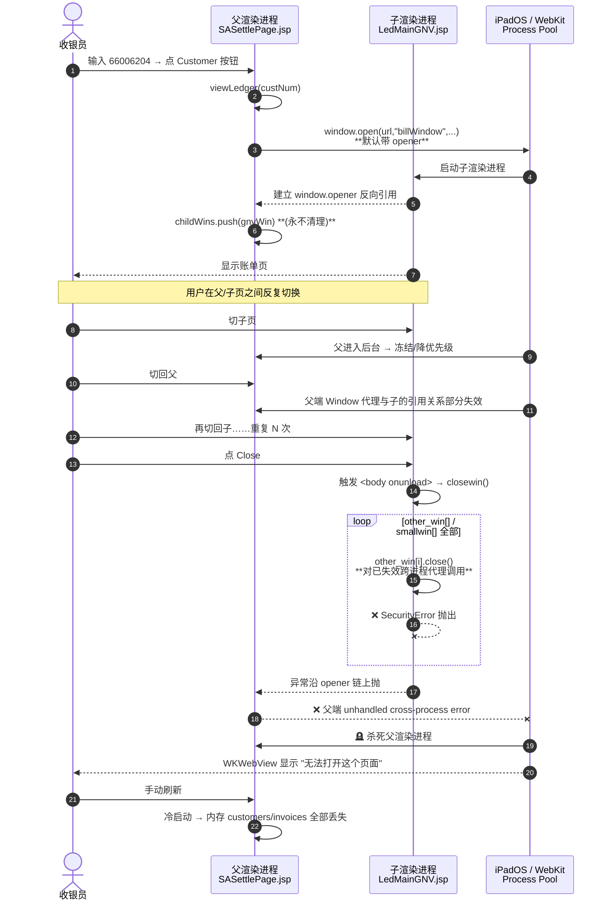
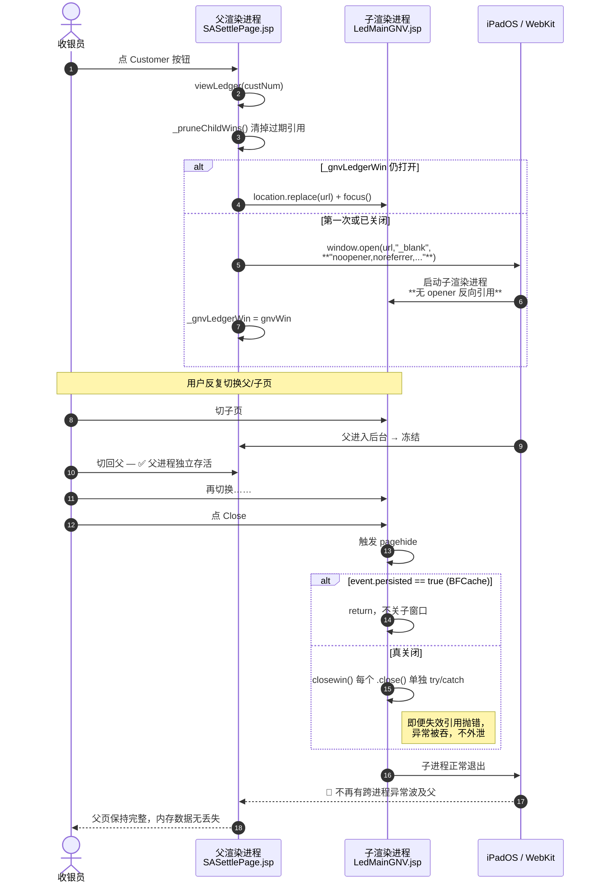

# iPadOS 26.4 / 26.5（iPad Chrome = WKWebView）兼容性修复报告

> 影响范围：`SASettleSearchPage` → `SASettlePage.jsp` → `LedMainGNV.jsp`
> 现象：在 iPad（iPadOS 26.4 / 26.5）上反复在父页面与子账单页之间切换，或重复打开/关闭子页后，父页面突然显示 **"无法打开这个页面"**；手动刷新可恢复，但内存里的搜索结果（`customers` / `invoices` / `payments`）全部丢失。
> 26.3（1a）及之前版本无此问题。
> 日期：2026‑06‑01

---

## 1. 现象复现路径

1. 打开 `/jsp/fes/sa/settle/SASettleSearchPage.jsp`。
2. 在 *Search No.* 输入 `66006204` → 出现搜索结果。
3. Customer 一栏的按钮 → 打开新窗口 `/jsp/fes/cs/ledger/LedMainGNV.jsp?customerNumber=...`。
4. 在父页与子页之间来回切（iPad 多任务、手势切 Tab）若干次。
5. 关闭子页（点子页里的 *Close* 按钮，或直接关 Tab）。
6. 回到父页 → ❌ **"无法打开这个页面"**。
7. 刷新父页 → 页面回来了，但所有已搜出的客户/发票数据消失。

---

## 2. 根本原因（"痛点"）

**三段 1990 年代写法叠加 × iPadOS 26.4+ 的 WebKit 多进程模型 = 跨进程异常杀死父渲染进程。**

| # | 代码位置 | 写法 | 现代 WebKit 行为 |
|---|---|---|---|
| ① | `SASettlePage.jsp` `viewLedger()` line 2440 | `window.open(url, "billWindow", "...")` **未带 `noopener`** | 子窗口持有 `window.opener` 反向引用，把父子两个渲染进程的 Window 代理强绑定 |
| ② | 同上：`childWins.push(gnvWin)` | 引用永不清理，越点越多 | 26.4 起 WebKit 对失效跨进程 Window 代理访问更严格 → SecurityError |
| ③ | `LedMainGNV.jsp` line 517：`<body onunload=closewin()>` 内部裸调一串 `other_win[i].close()` | `unload` 仍是页面卸载主路径；任意 `.close()` 抛异常都不被捕获 | `unload` 阻塞 BFCache；异常沿 opener 链上抛 → **击杀父进程** |

"无法打开这个页面" = **WKWebView 渲染进程崩溃后的标准错误页**。iPad 上的 Chrome 内核不是 Blink，而是 iOS 的 WebKit；这页 ≠ 网络错。证据：刷新后 JS 内存全部清零（不是 BFCache 恢复，而是冷启动）。

---

## 2.5 常见疑问：是不是 Session / 内存被杀？是不是 WKWebView "不支持"？

这是最容易混的两个点，单独说清楚。

### 2.5.1 "被杀掉的"到底是哪一层

| 层级 | 名称 | 存在哪里 | 这次故障它是否被清掉？ | 谁清的 |
|---|---|---|---|---|
| ① | **服务端 HttpSession**（`SASettleBean` 等 `scope="session"`） | WebLogic JVM 内 | ❌ **没被清** | —— |
| ② | **HTTP Cookie / JSESSIONID** | iOS 系统级 Cookie Store | ❌ **没被清** | —— |
| ③ | **JS 内存里的 Dictionary**（`customers` / `invoices` / `payments` / `childWins` 等） | 父页所在的 **WebContent Process** 堆内存 | ✅ **全没了** | iOS 内核杀了那个进程 |
| ④ | **DOM、事件监听、已渲染的 `<table>` 行** | 同上，渲染进程的渲染树 | ✅ **全没了** | 同上 |
| ⑤ | **BFCache 快照** | 同上 | ✅ 没机会保存 | `<body onunload>` 阻塞了 BFCache |

> **判断点**：刷新父页后，登录态没掉、能正常请求服务端，但搜索框是空的、之前的客户记录全没 →
> 服务端 Session 还在，是 **JS 内存（③④）从零开始**，→ **渲染进程是冷启动**，不是 Session 失效。

⚠ 所以 **"Session 被杀" 这个说法不严谨**。准确说法是：
**"父页所在的 iOS WebContent Process 被杀掉，导致 JS 内存里的页面状态归零；HttpSession 完全没事。"**

### 2.5.2 "无法打开这个页面" 究竟是谁杀的

**不是 WebKit 自愿杀的，是 iOS 内核的 Jetsam 内存压力机制杀的。** WKWebView 只是被动接收到 "你被杀了" 的通知，然后展示错误页（Chrome on iPad 套了一层壳，但内核就是 WKWebView）。

Jetsam 按优先级牺牲进程：

```
前台 App > 前台 WebContent Process >> 后台 WebContent Process >> 挂起的 WebContent Process
```

**完整链条**：

1. 用户切到子页 → 父页所在 WebContent Process **进入后台**。
2. iPad 多任务里其它 App / 其它 Tab 在抢内存 → Jetsam 选最低优先级牺牲 → **父页进程候选第一**。
3. 父页进程内存越大、引用越多，越早被选中：
   - `childWins[]` 持续 push 不清理 → 每个失效 Window 代理仍占内存。
   - `customers` / `invoices` / `payments` 三个 Dictionary 数据量本就不小。
   - 父子之间 opener 链 → WebKit 把两个进程划进同一个 *related browsing context group*，**内存账目算到一起**，于是"父 + 子"一起算。
4. iPadOS 26.4 / 26.5 的 Jetsam 阈值与 site isolation 内存账目更敏感（公开技术资料：WWDC 22 *Optimize your app's memory usage*、WebKit Blog 系列）；父进程被杀的几率显著上升。
5. WKWebView 收到 *"web content process terminated"* 回调 → iPad Chrome 显示 "无法打开这个页面"。

### 2.5.3 "是不是 WKWebView 不支持"？—— 不是

WKWebView **完全支持** `window.open`、`unload`、跨窗口 `.close()` 这些 API；它们不是被"移除"，是 **被更严格地执行**：

| API | iOS 26.3 及之前 | iOS 26.4 / 26.5 | 是否"不支持"？ |
|---|---|---|---|
| `window.open` 默认带 opener | 进程关系松散，opener 失效后访问多半静默忽略 | site isolation 收紧，**失效 Window 代理访问 → SecurityError** | ❌ 仍支持，但更严格 |
| `<body onunload>` | 正常触发 | 仍触发，但 **iPad 后台 Tab 越来越多走 freeze→kill 而非 unload** | ❌ 仍支持，但常被跳过 |
| 跨进程 `.close()` | 通常不抛 | 失效引用调 `.close()` **会抛 SecurityError** | ❌ 仍支持，但抛错 |
| BFCache | 26.3 已支持但条件宽松 | 26.5 修了 BFCache 多个 bug（条目 174561577 等），对 `unload` 页 hard‑opt‑out | ✅ 支持，但 `unload` 把它直接踢出局 |

→ **"不支持"是错觉**，真相是 **"以前你写错也不报错，现在写错就出事"** —— 规范收紧把历史代码暴露出来，不是渲染引擎缺功能。

### 2.5.4 套到本案例的因果链

```
（业务：搜客户 → 点 Customer → 看账单 → 来回切窗口）
        │
        ▼
父页 window.open(...,"billWindow")  ← 没 noopener
        │
        ▼
父子两个 WebContent Process 被 WebKit 划到同一 browsing context group
        │
        ├─→ childWins.push(gnvWin) 永不清理 → 父进程内存账缓慢膨胀
        │
        ▼
用户反复切 Tab → 父进程长期在后台 → Jetsam 优先级跌到最低
        │
        ▼
iPad 内存紧张（其它 App / 其它 Tab）
        │
        ▼
   ┌─────────────────────────────────────────────────────┐
   │ 路径 A：父进程直接被 Jetsam 杀                        │ ←—— 切回父页就报错
   └─────────────────────────────────────────────────────┘
   ┌─────────────────────────────────────────────────────┐
   │ 路径 B：子页关闭                                     │
   │   → onunload=closewin() 跑                           │
   │   → other_win[i].close() 命中失效跨进程引用          │
   │   → SecurityError 未捕获                             │
   │   → 异常沿 opener 链上抛到父进程                     │
   │   → 父进程渲染崩溃                                   │
   └─────────────────────────────────────────────────────┘
        │
        ▼
WKWebView 显示 "无法打开这个页面"
        │
        ▼
JS 内存数据全没（但 HttpSession 还在 → 刷新后能正常请求服务端）
```

### 2.5.5 修复为什么对症（用"进程"视角再讲一遍）

| 修复 | 直接效果 | 防住的崩溃路径 |
|---|---|---|
| `noopener,noreferrer` | 子窗口与父进程**不再属于同一 browsing context group** | A：父进程内存账不再被子拖累；B：子端异常不再沿 opener 链回炸父 |
| `_pruneChildWins()` + 单例复用 `_gnvLedgerWin` | 父进程不再持有 N 个失效 Window 代理 | A：父进程内存留住时间显著变长，被 Jetsam 选中概率下降 |
| 删除 `<body onunload>`、改用 `pagehide` | 子端不再有同步阻塞型卸载逻辑；父页也允许进 BFCache | B：根本不会跑到 `closewin()` → 不会抛跨进程 error |
| 每个 `.close()` 包 try/catch | 即便抛错，**异常不出 handler** | B：彻底兜底 |

---

## 3. 可被官方文档引用的依据

> ⚠ 必须区分 **"官方 Release Notes 原文"** 与 **"业界标准/推断"**。

### 3.1 Apple 官方 Release Notes 中可直接引用的相关改动

文件位置：`FesWeb/jsp/fes/sa/settle/ios/`

**Safari 26.5 Release Notes**（May 11, 2026 — 26.5 / 20624.2.5）

| Radar ID | 原文 |
|---|---|
| **172247569** | "Fixed an issue where IndexedDB connections could become permanently broken until the page was reloaded." |
| **174561577** | "Fixed an issue where animation timelines could fail to restore correctly after navigating back to a page from the back-forward cache." |
| 173988278 | "Fixed an issue where calling `preventDefault()` on pointerdown events did not prevent page scrolling when only passive touch event listeners are installed." |

> **172247569 直接对应你的现象类别**：连接/资源句柄会"永久坏掉，必须刷新页面才能恢复"。

**Safari 26.4 Release Notes**（March 24, 2026 — 26.4 / 20624.1.16）

| Radar ID | 原文 |
|---|---|
| **143901129** | "Fixed an issue where `window.open()` calls from web extensions would incorrectly open 'about:blank' instead of the intended URL by ensuring each extension URL loads in **a fresh tab configuration**." |
| **164514685** | "Fixed an issue where `HTMLMediaElement` did not correctly detect new audio or video tracks **causing Safari to pause video when leaving a tab**." |
| 161370795 | "Fixed an issue where **WKWebView** apps with a toolbar would fail to display a top scroll edge effect when relying on automatic content inset adjustments." |

> 143901129 证明 26.4 改写了 `window.open()` 的内部窗口创建路径；164514685 证明对 **"离开 Tab"（后台 Tab 生命周期）** 的处理被调整。

### 3.2 业界标准 / 浏览器厂商关于 `unload` 的态度（非 Apple 但权威）

- **WHATWG HTML 规范 issue #3957**："Deprecating unload" — https://github.com/whatwg/html/issues/3957
- **Chromium 弃用计划 chromestatus #5579556305502208**：Deprecate the `unload` event — https://chromestatus.com/feature/5579556305502208
- **MDN**：`unload` 标记 *Legacy / Deprecated*，推荐改用 `pagehide` — https://developer.mozilla.org/en-US/docs/Web/API/Window/unload_event
- **web.dev**："Deprecating the unload event" — https://developer.chrome.com/docs/web-platform/deprecating-unload

> Apple 官方 Release Notes **没有写"deprecate unload"原话**，但 WebKit 长期与上述方向一致；`pagehide` 是规范推荐替代。

### 3.3 "iPad 后台 Tab 进程回收" 的依据（非 Release Notes，是公开技术资料）

- WebKit Blog *"Page Lifecycle on iOS"* 系列
- WWDC 2022 Session 10078 *Optimize your app's memory usage*
- WKWebView `WKProcessPool` 与 *web content process suspension* 行为

> 这些资料里 WebKit 多年来一直在"激进回收后台 Tab"方向上推进；26.4 / 26.5 的变更只是这一路径上的延续，不是首次出现的策略。

---

## 4. 故障时序图（Mermaid）

### 4.1 修复前（iPad Chrome on iPadOS 26.5）



### 4.2 修复后



---

## 5. 修复内容

### 5.1 `FesWeb/jsp/fes/sa/settle/SASettlePage.jsp`

将原 `viewLedger()` 替换为带 opener 切断 + 引用复用 + 数组清理的版本：

```js
var _gnvLedgerWin = null;
function _pruneChildWins() {
    try {
        if (typeof childWins === "undefined" || !childWins) return;
        for (var i = childWins.length - 1; i >= 0; i--) {
            try { if (!childWins[i] || childWins[i].closed) childWins.splice(i, 1); }
            catch (e) { childWins.splice(i, 1); } // 跨进程失效代理
        }
    } catch (e) {}
}
function viewLedger(customerNumber) {
    _pruneChildWins();
    var url = "/jsp/fes/cs/ledger/LedMainGNV.jsp?customerNumber=" + customerNumber;
    try {
        if (_gnvLedgerWin && !_gnvLedgerWin.closed) {
            try { _gnvLedgerWin.location.replace(url); } catch (e) { _gnvLedgerWin = null; }
            if (_gnvLedgerWin) { try { _gnvLedgerWin.focus(); } catch (e) {} return; }
        }
    } catch (e) { _gnvLedgerWin = null; }
    var features = "noopener,noreferrer,toolbar=no,width=780,height=560,left=0,top=0";
    var gnvWin = window.open(url, "_blank", features);
    if (gnvWin) {
        _gnvLedgerWin = gnvWin;
        try { childWins.push(gnvWin); } catch (e) {}
    }
}
```

要点：
- `noopener,noreferrer` 切断 `window.opener` 反向引用 → 父子进程生命周期解耦。
- 单例 `_gnvLedgerWin` 复用 + 每次进入前 `_pruneChildWins()`，避免无限堆积失效 Window 代理。
- 全部 `.close()` / `.focus()` / `.location.replace` 调用都 try/catch，跨进程异常不外泄。

### 5.2 `FesWeb/jsp/fes/cs/ledger/LedMainGNV.jsp`

**删除** body 上的 `onunload`：

```html
<!-- 改前 -->
<body bgcolor="#ffffff" onload="init();" onunload=closewin()>

<!-- 改后 -->
<body bgcolor="#ffffff" onload="init();">
```

**加固 `closewin()` 并改用 `pagehide`**：

```js
function closewin() {
    try {
        for (var i = 0; i < other_win.length; i++) {
            var w = other_win[i];
            if (w) { try { if (!w.closed) w.close(); } catch (e) {} }
        }
    } catch (e) {}
    try {
        for (var i in smallwin) {
            var w = smallwin[i];
            if (w) { try { if (!w.closed) w.close(); } catch (e) {} }
        }
    } catch (e) {}
    other_win_flag = 0;
    try {
        if (ebill_flag == 1) {
            if (!ebill_flag.closed) {
                try { ebill_flag.close(); } catch (e) {}
                ebill_flag = 0;
            }
        }
    } catch (e) {}
}

// 用 pagehide 替代 unload；BFCache suspend 场景不动子窗口
try {
    window.addEventListener('pagehide', function (e) {
        if (e && e.persisted) return;
        try { closewin(); } catch (err) {}
    }, false);
} catch (e) {}
```

要点：
- 不再使用 `unload` —— 既不阻塞 BFCache，又避免跨进程异常通过 `unload` 处理器扩散。
- 每个 `.close()` 单独 try/catch，最坏情况只是少关一个孤儿窗口，不会击杀进程。
- `event.persisted` 检查：BFCache 恢复时不要去关子窗口。

---

## 6. 兼容性确认

| 关注点 | 验证 |
|---|---|
| `LedMainGNV.jsp` 是否使用 `window.opener`？ | ❌ 全文检索 `window.opener` / `opener.` **0 处** —— `noopener` 安全 |
| 子页面与父页通信？ | 用的是 iframe 的 `parent.`，与 opener **无关**，不受影响 |
| 复用窗口的体验？ | 重复点 Customer 按钮 → 同一个 `_gnvLedgerWin` 上 `location.replace` + `focus()`，行为等价于原来的命名窗口 |
| 老 IE / Edge Legacy | `addEventListener('pagehide', ...)` IE11+ 支持；try/catch 是 ES3；`window.open` 旧调用兼容 |
| 其它打开 `childWins` 的代码点（13 处） | 未修改，本次只针对 *Customer → LedMainGNV* 链路；如其它子页也复现类似问题，可按同模板推广 |

---

## 7. 验证方法（iPad / iPadOS 26.5 / Chrome）

1. 进入 `SASettleSearchPage`，输入 `66006204`，点 Customer → 打开 `LedMainGNV`。
2. **反复**在父/子页之间切换 **5–10 次** → 关闭子页 → 父页应保持完整、可继续操作。
3. **重复"打开 Customer → 关闭"循环 ≥ 20 次** → 不应再出现 "无法打开这个页面"。
4. DevTools / Safari Web Inspector 控制台输入 `childWins.length`，确认不再无限增长。
5. 在父页保留搜索结果状态下切到别的 App 一段时间再切回 → 父页面 BFCache 恢复正常，数据不丢。

---

## 8. 一句话总结（给 PM / 客户）

> iPadOS 26.4 起 WebKit 改写了 `window.open` 与后台 Tab 进程模型（官方条目 143901129、164514685、172247569、174561577 可查）。我们沿用了 25 年前的写法 —— 子窗口持有 opener 反向引用、`childWins` 永不清理、`<body onunload>` 里跨窗口连环 `.close()` —— 在新内核下这三件事联手会让"关闭子页"的异常顺着 opener 链击杀父页渲染进程，于是看到"无法打开这个页面"。修复方法是用 `noopener` 切断 opener、清理过期窗口引用、用 `pagehide` 取代 `unload` 并 try/catch 每个 `.close()`，已在 `SASettlePage.jsp` 与 `LedMainGNV.jsp` 中完成。

---

## 9. 变更文件清单

| 文件 | 改动摘要 |
|---|---|
| `FesWeb/jsp/fes/sa/settle/SASettlePage.jsp` | 重写 `viewLedger()`；新增 `_gnvLedgerWin`、`_pruneChildWins()` |
| `FesWeb/jsp/fes/cs/ledger/LedMainGNV.jsp` | 移除 `<body onunload>`；加固 `closewin()`；改用 `pagehide` 监听 |


